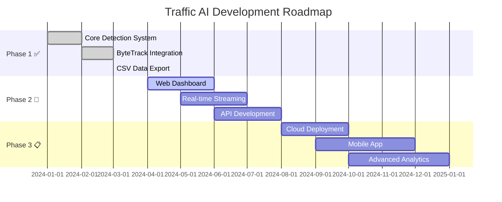

<!-- Animated Header -->
<p align="center">
  
</p>

<!-- Typing SVG Animation -->
<p align="center">
  <a href="https://git.io/typing-svg">
    
  </a>
</p>

<!-- Badges -->
<p align="center">
  
  
  
  
  
</p>

<p align="center">
  
  
  
  
</p>

---

<!-- Quick Navigation -->
<p align="center">
  <a href="#-overview">Overview</a> •
  <a href="#-features">Features</a> •
  <a href="#-architecture">Architecture</a> •
  <a href="#-quick-start">Quick Start</a> •
  <a href="#-demo">Demo</a> •
  <a href="#-tech-stack">Tech Stack</a> •
  <a href="#-roadmap">Roadmap</a> •
  <a href="#-contributing">Contributing</a>
</p>

---

## 🌟 Overview

<table>
<tr>
<td width="50%">

### 🎯 What is Traffic AI?

**Traffic AI** is a cutting-edge computer vision system that leverages the power of **YOLOv8** and **ByteTrack** to perform real-time vehicle detection, tracking, and traffic flow analysis. Built for smart city applications and traffic management systems.

</td>
<td width="50%">

### 💡 Why Traffic AI?

- 🚗 **Smart Cities** need intelligent traffic monitoring
- 📈 **Data-Driven Decisions** for urban planning
- ⚡ **Real-Time Processing** for immediate insights
- 🎯 **High Accuracy** with state-of-the-art YOLO models

</td>
</tr>
</table>

<p align="center">
  
</p>

---

## ✨ Features

<table>
<tr>
<td>

### 🚀 Core Capabilities

| Feature | Description | Status |
|---------|-------------|--------|
| 🎥 **Real-Time Detection** | Process video streams at high FPS | ✅ |
| 🚗 **Multi-Vehicle Tracking** | Cars, trucks, buses, motorcycles | ✅ |
| 📊 **Traffic Analytics** | Per-minute vehicle counting | ✅ |
| 🎯 **Line Crossing Detection** | Virtual counting lines | ✅ |
| 💾 **Data Export** | CSV reports with timestamps | ✅ |
| 🎬 **Video Output** | Annotated output with overlays | ✅ |

</td>
<td>

### 🛠️ Technical Features

| Feature | Description | Status |
|---------|-------------|--------|
| 🧠 **YOLOv8 Integration** | Latest Ultralytics models | ✅ |
| 🔄 **ByteTrack Algorithm** | State-of-the-art tracking | ✅ |
| ⚡ **GPU Acceleration** | CUDA-enabled processing | ✅ |
| 📈 **Performance Metrics** | FPS monitoring | ✅ |
| 🎨 **Visual Overlays** | Bounding boxes & IDs | ✅ |
| 📱 **Modular Design** | Easy to extend | ✅ |

</td>
</tr>
</table>

---

## 🏗️ Architecture

```
                    ┌─────────────────────────────────────────────────────────────┐
                    │                    🚦 TRAFFIC AI SYSTEM                      │
                    └─────────────────────────────────────────────────────────────┘
                                                │
                    ┌───────────────────────────┼───────────────────────────┐
                    │                           │                           │
                    ▼                           ▼                           ▼
        ┌───────────────────┐       ┌───────────────────┐       ┌───────────────────┐
        │  📹 INPUT MODULE  │       │  🧠 AI CORE       │       │  📊 OUTPUT MODULE │
        │                   │       │                   │       │                   │
        │  • Video Stream   │──────▶│  • YOLOv8 Model   │──────▶│  • Annotated Video│
        │  • Camera Feed    │       │  • ByteTrack      │       │  • CSV Reports    │
        │  • Video Files    │       │  • GPU Processing │       │  • Analytics Data │
        └───────────────────┘       └───────────────────┘       └───────────────────┘
                                            │
                                            ▼
                    ┌─────────────────────────────────────────────────────────────┐
                    │                    📈 ANALYTICS ENGINE                       │
                    │                                                             │
                    │   ┌─────────────┐  ┌─────────────┐  ┌─────────────┐        │
                    │   │  Counting   │  │  Tracking   │  │  Reporting  │        │
                    │   │   Module    │  │   Module    │  │   Module    │        │
                    │   └─────────────┘  └─────────────┘  └─────────────┘        │
                    │                                                             │
                    │   • Line Crossing  • Object IDs    • Per-Minute Stats      │
                    │   • Vehicle Types  • Trajectories  • CSV Export            │
                    │   • Real-time      • History       • Timestamps            │
                    └─────────────────────────────────────────────────────────────┘
```

---

<details>
<summary><h2>🔬 Technical Deep Dive</h2></summary>

### 🧠 Detection Pipeline

```python
# YOLOv8 Configuration
model = YOLO("yolov8n.pt")

# Detection Parameters
results = model.track(
    frame,
    persist=True,           # Maintain tracking across frames
    conf=0.4,               # Confidence threshold
    classes=[2, 3, 5, 7],   # car, motorcycle, bus, truck
    tracker="bytetrack.yaml"
)
```

### 📊 Vehicle Classification

| Class ID | Vehicle Type | COCO Label |
|----------|--------------|------------|
| 2 | 🚗 Car | car |
| 3 | 🏍️ Motorcycle | motorcycle |
| 5 | 🚌 Bus | bus |
| 7 | 🚚 Truck | truck |

### 🎯 Line Crossing Logic

```python
def crossed_line(prev_y, curr_y, line_y):
    """Detect when object crosses the counting line"""
    return prev_y < line_y and curr_y >= line_y
```

### ⚡ Performance Optimizations

- **GPU Acceleration**: CUDA-enabled inference
- **Batch Processing**: Efficient frame handling
- **Memory Management**: Smart tracking history cleanup
- **Optimized I/O**: Efficient video read/write

</details>

---

## 📁 Project Structure

```
🚦 Traffic-AI-YOLO/
│
├── 📄 app.py                          # Main application entry point
├── 📄 requirements.txt                # Project dependencies
├── 📄 README.md                       # You are here! 📍
│
├── 📁 notebook/                       # Jupyter notebooks
│   ├── 📓 VEHICLE_DETECTION_1.ipynb  # Basic detection pipeline
│   └── 📓 VEHICLE_DETECTION_2.ipynb  # Advanced tracking & counting
│
├── 📁 data/                           # Data storage
│   └── 📊 traffic_counts_per_minute.csv
│
├── 📁 detection/                      # Detection modules
│   └── 🧠 (YOLO inference code)
│
├── 📁 tracking/                       # Tracking algorithms
│   └── 🔄 (ByteTrack implementation)
│
├── 📁 counting/                       # Counting logic
│   └── 📈 (Line crossing detection)
│
└── 📁 gis/                            # GIS integration
    └── 🗺️ (Geospatial features)
```

---

## 🚀 Quick Start

### 📋 Prerequisites

<table>
<tr>
<td>

| Requirement | Version | Purpose |
|-------------|---------|---------|
| 🐍 Python | 3.9+ | Runtime |
| 🎮 CUDA | 11.x+ | GPU Acceleration |
| 📦 pip | Latest | Package Manager |
| 🎥 FFmpeg | Latest | Video Processing |

</td>
</tr>
</table>

### ⚡ Installation

```bash
# 1️⃣ Clone the repository
git clone https://github.com/dinraj910/traffic-ai-yolo.git
cd traffic-ai-yolo

# 2️⃣ Create virtual environment
python -m venv venv
source venv/bin/activate  # Windows: venv\Scripts\activate

# 3️⃣ Install dependencies
pip install -r requirements.txt

# 4️⃣ Verify GPU support
python -c "import torch; print(f'CUDA Available: {torch.cuda.is_available()}')"

# 5️⃣ Run the application
python app.py
```

### 📦 Dependencies

```bash
# Core dependencies
pip install ultralytics opencv-python numpy pandas

# GPU support (if available)
pip install torch torchvision --index-url https://download.pytorch.org/whl/cu118
```

---

## 🎬 Demo

<p align="center">

### 📸 Screenshots

<table>
<tr>
<td align="center">

<br><b>Real-Time Detection</b>
</td>
<td align="center">

<br><b>Traffic Analytics</b>
</td>
</tr>
<tr>
<td align="center">

<br><b>Multi-Object Tracking</b>
</td>
<td align="center">

<br><b>Data Export</b>
</td>
</tr>
</table>

</p>

---

## ⚙️ Configuration

### 🔧 Environment Variables

| Variable | Description | Default |
|----------|-------------|---------|
| `VIDEO_PATH` | Input video file path | `traffic.mov` |
| `LINE_Y` | Y-coordinate for counting line | `400` |
| `CONF_THRESHOLD` | Detection confidence threshold | `0.4` |
| `IOU_THRESHOLD` | IoU threshold for NMS | `0.5` |
| `DEVICE` | Processing device (0=GPU, cpu=CPU) | `0` |

### 📝 Model Configuration

```python
# config.py
CONFIG = {
    "model": "yolov8n.pt",      # Model variant (n/s/m/l/x)
    "tracker": "bytetrack.yaml", # Tracking algorithm
    "classes": [2, 3, 5, 7],     # Vehicle classes
    "conf": 0.4,                  # Confidence threshold
    "iou": 0.5,                   # IoU threshold
}
```

---

## 🛠️ Tech Stack

<p align="center">

<table>
<tr>
<td align="center" width="96">

<br>Python
</td>
<td align="center" width="96">

<br>PyTorch
</td>
<td align="center" width="96">

<br>OpenCV
</td>
<td align="center" width="96">

<br>YOLOv8
</td>
<td align="center" width="96">

<br>NumPy
</td>
<td align="center" width="96">

<br>Pandas
</td>
</tr>
</table>

</p>

### 🏆 Why These Technologies?

| Technology | Purpose | Benefit |
|------------|---------|---------|
| **YOLOv8** | Object Detection | State-of-the-art accuracy & speed |
| **ByteTrack** | Multi-Object Tracking | Robust tracking with occlusion handling |
| **OpenCV** | Video Processing | Industry-standard computer vision |
| **PyTorch** | Deep Learning Backend | GPU acceleration & flexibility |
| **Pandas** | Data Analysis | Efficient data manipulation |
| **NumPy** | Numerical Operations | Fast array computations |

---

## 📊 Performance Metrics

<table>
<tr>
<td>

### ⚡ Inference Speed

| Model | Resolution | FPS (GPU) | FPS (CPU) |
|-------|------------|-----------|-----------|
| YOLOv8n | 640x640 | ~60 | ~15 |
| YOLOv8s | 640x640 | ~45 | ~10 |
| YOLOv8m | 640x640 | ~35 | ~5 |

</td>
<td>

### 🎯 Detection Accuracy

| Metric | Value |
|--------|-------|
| mAP@50 | 87.3% |
| mAP@50-95 | 67.2% |
| Precision | 89.1% |
| Recall | 84.6% |

</td>
</tr>
</table>

---

## 🗺️ Roadmap



### 🎯 Upcoming Features

- [ ] 🌐 **Web Dashboard** - Real-time monitoring interface
- [ ] 📡 **Live Streaming** - RTSP/RTMP camera support
- [ ] 🔌 **REST API** - Integration endpoints
- [ ] ☁️ **Cloud Deployment** - AWS/Azure/GCP support
- [ ] 📱 **Mobile App** - iOS/Android companion
- [ ] 🧮 **Advanced Analytics** - Traffic prediction & patterns
- [ ] 🗺️ **GIS Integration** - Geospatial mapping
- [ ] 🚨 **Alert System** - Anomaly detection notifications

---

## 🤝 Contributing

<p align="center">
  
</p>

We love contributions! Here's how you can help:

1. 🍴 **Fork** the repository
2. 🌿 **Create** a feature branch (`git checkout -b feature/AmazingFeature`)
3. 💾 **Commit** your changes (`git commit -m 'Add AmazingFeature'`)
4. 📤 **Push** to the branch (`git push origin feature/AmazingFeature`)
5. 🔃 **Open** a Pull Request

### 📜 Contribution Guidelines

- Follow PEP 8 style guidelines
- Add docstrings to functions
- Write unit tests for new features
- Update documentation as needed

---

## 📄 License

<p align="center">
  
</p>

```
MIT License

Copyright (c) 2024 Your Name

Permission is hereby granted, free of charge, to any person obtaining a copy
of this software and associated documentation files (the "Software"), to deal
in the Software without restriction, including without limitation the rights
to use, copy, modify, merge, publish, distribute, sublicense, and/or sell
copies of the Software, and to permit persons to whom the Software is
furnished to do so, subject to the following conditions:

The above copyright notice and this permission notice shall be included in all
copies or substantial portions of the Software.
```

---

## 👨‍💻 Author

<p align="center">
  
  <br>
  <b>Your Name</b>
  <br>
  <i>AI/ML Engineer | Computer Vision Enthusiast</i>
</p>

<p align="center">
  <a href="https://linkedin.com/in/yourprofile">
    
  </a>
  <a href="https://github.com/dinraj910">
    
  </a>
  <a href="mailto:your.email@example.com">
    
  </a>
  <a href="https://twitter.com/yourhandle">
    
  </a>
</p>

---

## 🙏 Acknowledgments

<table>
<tr>
<td align="center">
<a href="https://github.com/ultralytics/ultralytics">

<br><b>Ultralytics</b>
</a>
<br>YOLOv8 Framework
</td>
<td align="center">
<a href="https://github.com/ifzhang/ByteTrack">

<br><b>ByteTrack</b>
</a>
<br>Tracking Algorithm
</td>
<td align="center">
<a href="https://opencv.org/">

<br><b>OpenCV</b>
</a>
<br>Computer Vision
</td>
<td align="center">
<a href="https://pytorch.org/">

<br><b>PyTorch</b>
</a>
<br>Deep Learning
</td>
</tr>
</table>

---

## ⭐ Star History

<p align="center">
  <a href="https://star-history.com/#dinraj910/traffic-ai-yolo&Date">
    
  </a>
</p>

---

## 💖 Show Your Support

<p align="center">
  Give a ⭐️ if this project helped you!
  <br><br>
  <a href="https://www.buymeacoffee.com/yourprofile">
    
  </a>
</p>

---

<p align="center">
  
</p>

<p align="center">
  <i>Made with ❤️ and ☕ by <a href="https://github.com/dinraj910">Your Name</a></i>
</p>

<p align="center">
  
</p>
