<p align="center">
  
</p>

<p align="center">
  
</p>

<!-- Animated Divider -->
<p align="center">
  
</p>

<!-- Badges -->
<p align="center">
  
  
  
  
  
</p>

<p align="center">
  
  
  
  
  
</p>

<p align="center">
  
  
  
</p>

---

## 📑 Table of Contents

<details open>
<summary>Click to expand</summary>

- [🌟 Overview](#-overview)
- [✨ Features](#-features)
- [📸 Screenshots](#-screenshots)
- [🏗️ Architecture](#️-architecture)
- [🚀 Quick Start](#-quick-start)
- [🛠️ Tech Stack](#️-tech-stack)
- [📊 Dashboard Features](#-dashboard-features)
- [⚙️ Configuration](#️-configuration)
- [🗺️ Roadmap](#️-roadmap)
- [🤝 Contributing](#-contributing)
- [📄 License](#-license)

</details>

---

## 🌟 Overview

<table>
<tr>
<td width="50%">

### 🎯 What is Traffic AI?

**Traffic AI** is a comprehensive computer vision system that combines the power of **YOLOv8** object detection with a **professional-grade web dashboard** for real-time traffic monitoring and analysis. Built for smart city applications, urban planners, and traffic engineers.

**This project includes:**
- 🤖 **AI Core**: YOLOv8 + ByteTrack detection & tracking
- 🌐 **Web Dashboard**: React + FastAPI full-stack application
- 📊 **Analytics Engine**: Real-time traffic insights
- 🗺️ **GIS Visualization**: Interactive heatmaps with Leaflet

</td>
<td width="50%">

### 💡 Key Highlights

| Feature | Description |
|---------|-------------|
| 🚗 **Real-Time Detection** | Process video at high FPS with GPU |
| 📈 **Smart Analytics** | Per-minute vehicle counting & trends |
| 🌙 **Dark/Light Mode** | Professional UI with theme support |
| 🗺️ **GIS Heatmaps** | Time-animated traffic density maps |
| 📱 **Responsive Design** | Works on desktop, tablet & mobile |
| 📥 **Data Export** | CSV, JSON & PDF report generation |

</td>
</tr>
</table>

---

## ✨ Features

### 🤖 AI Detection Pipeline

| Feature | Description | Status |
|---------|-------------|--------|
| 🎥 **Real-Time Detection** | Process video streams at 30+ FPS | ✅ |
| 🚗 **Multi-Vehicle Tracking** | Cars, trucks, buses, motorcycles | ✅ |
| 🎯 **Line Crossing Detection** | Virtual counting lines | ✅ |
| 🧠 **YOLOv8 Integration** | Latest Ultralytics models | ✅ |
| 🔄 **ByteTrack Algorithm** | State-of-the-art tracking | ✅ |
| ⚡ **GPU Acceleration** | CUDA-enabled processing | ✅ |

### 🌐 Web Dashboard (NEW!)

| Feature | Description | Status |
|---------|-------------|--------|
| 📊 **Interactive Charts** | Line, Bar, Area, Pie with Recharts | ✅ |
| 🗺️ **GIS Heatmaps** | Leaflet maps with density visualization | ✅ |
| ⏱️ **Time Slider** | Animate traffic patterns over time | ✅ |
| 🎬 **Video Analytics** | Stream processed YOLO video | ✅ |
| 🌙 **Dark/Light Theme** | Professional UI theming | ✅ |
| 📥 **Export Options** | CSV, JSON, Markdown reports | ✅ |
| 📱 **Responsive Layout** | Mobile-first design | ✅ |
| ⚡ **Real-Time Updates** | TanStack Query data fetching | ✅ |

---

## 📸 Screenshots

### 🏠 Dashboard Overview
<p align="center">
  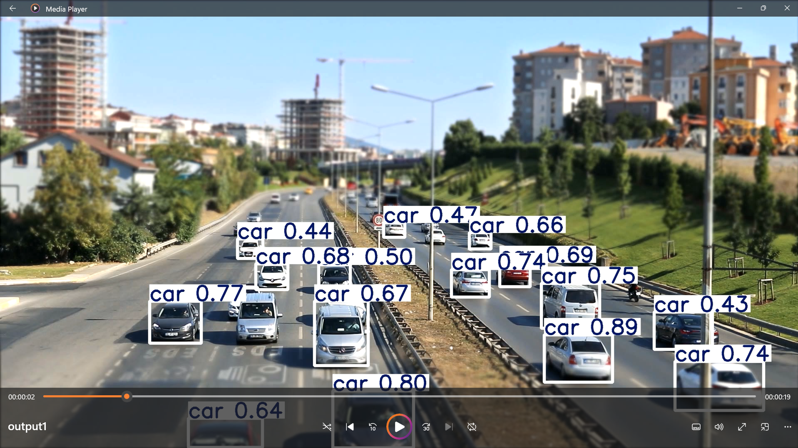
</p>

### 📊 Traffic Analytics & Charts
<table>
<tr>
<td width="50%">
  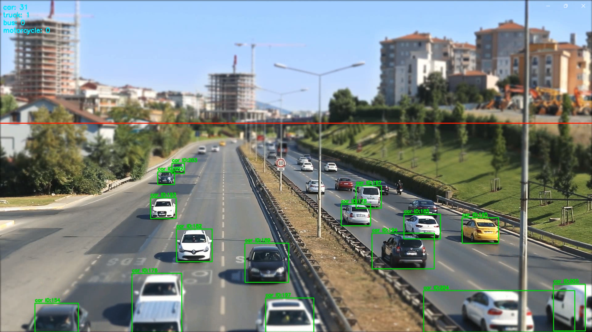
</td>
<td width="50%">
  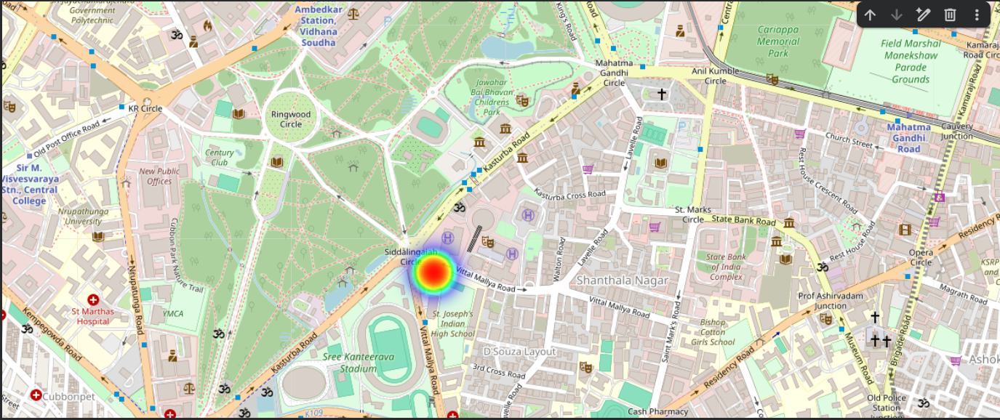
</td>
</tr>
<tr>
<td width="50%">
  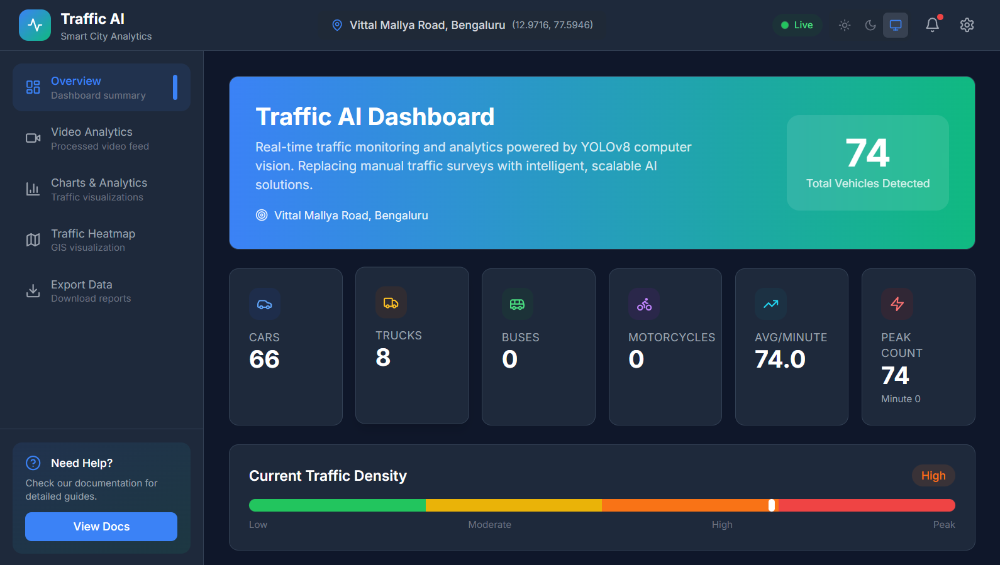
</td>
<td width="50%">
  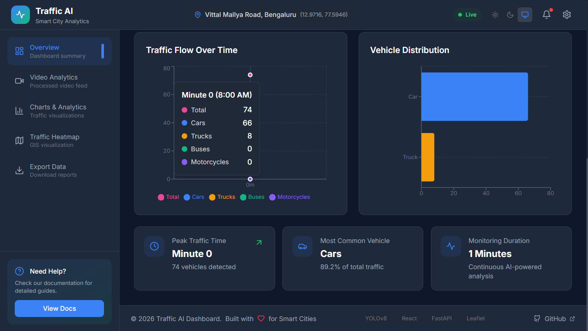
</td>
</tr>
</table>

### 🎬 Video Analytics Section
<table>
<tr>
<td width="50%">
  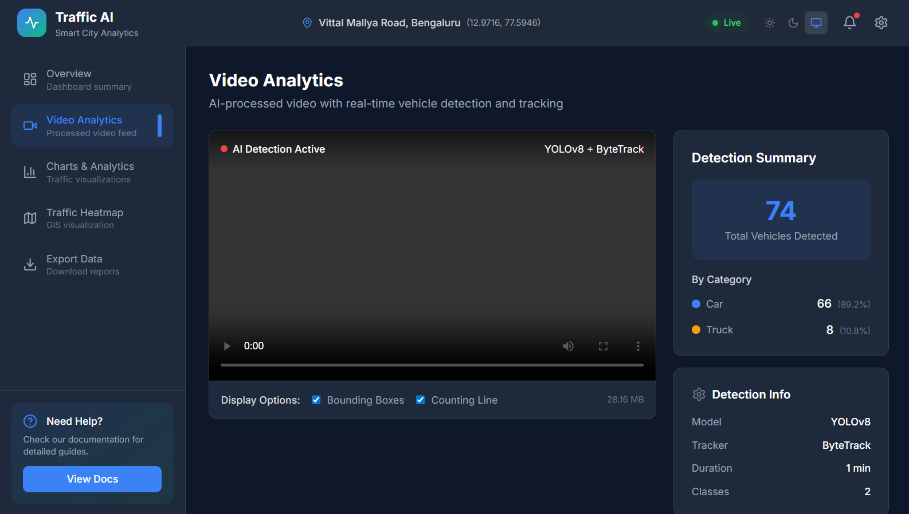
</td>
<td width="50%">
  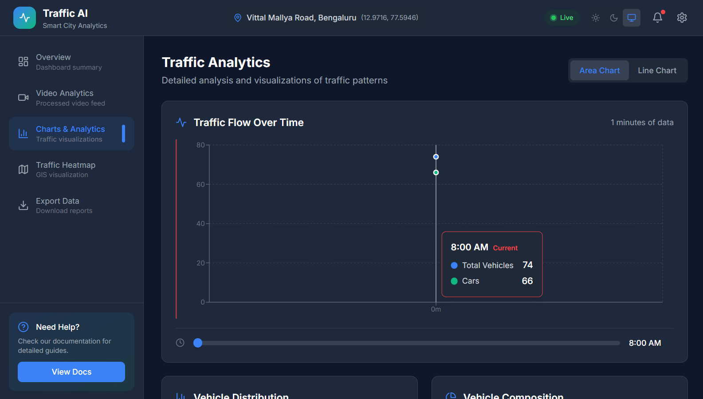
</td>
</tr>
</table>

### 🗺️ GIS Heatmap & Time Animation
<table>
<tr>
<td width="50%">
  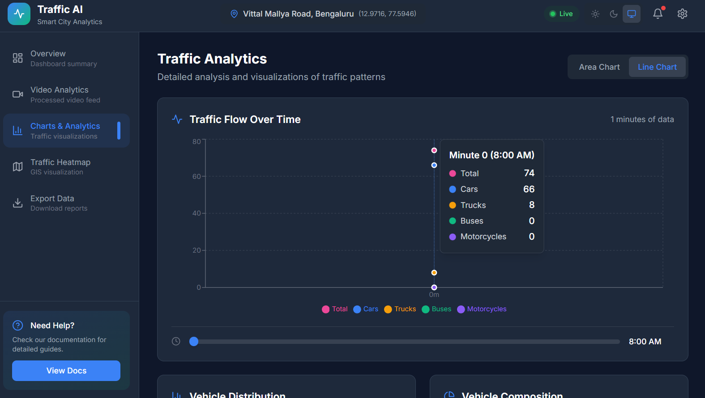
</td>
<td width="50%">
  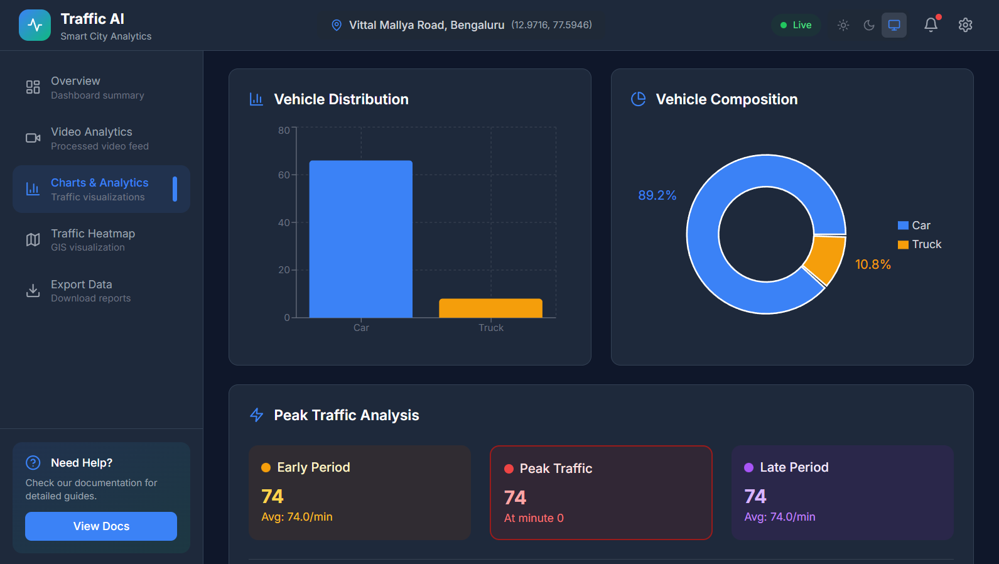
</td>
</tr>
</table>

### 🌙 Dark Mode & Additional Views
<table>
<tr>
<td width="33%">
  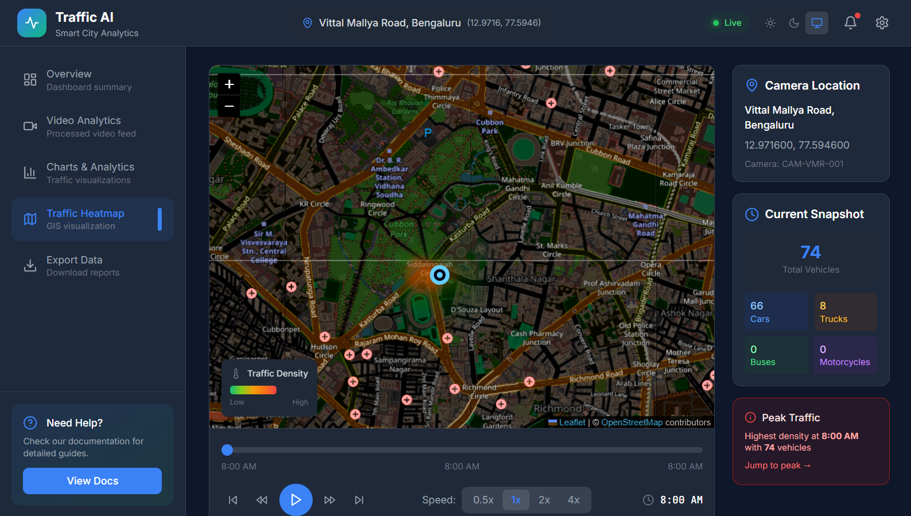
</td>
<td width="33%">
  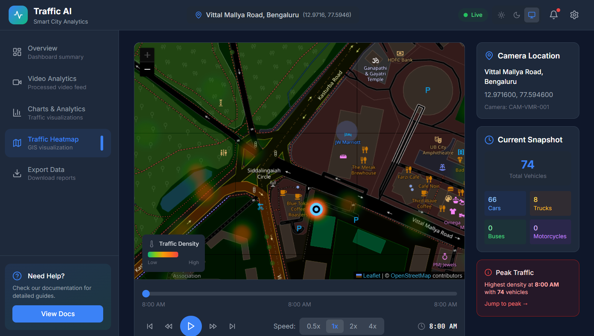
</td>
<td width="33%">
  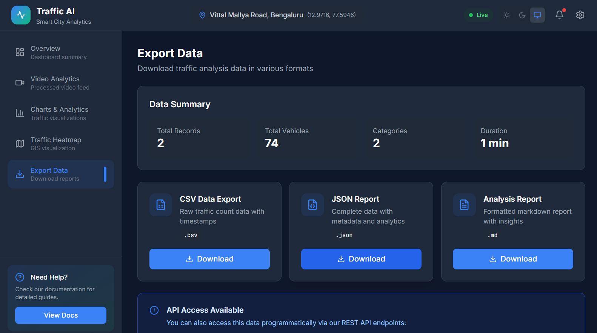
</td>
</tr>
</table>

---

## 🏗️ Architecture

```
┌─────────────────────────────────────────────────────────────────────────────────┐
│                            🚦 TRAFFIC AI SYSTEM                                 │
├─────────────────────────────────────────────────────────────────────────────────┤
│                                                                                 │
│   ┌─────────────────┐      ┌─────────────────┐      ┌─────────────────┐        │
│   │  🤖 AI PIPELINE │      │  ⚡ BACKEND     │      │  🎨 FRONTEND    │        │
│   │                 │      │                 │      │                 │        │
│   │  • YOLOv8       │ ───▶ │  • FastAPI      │ ───▶ │  • React 18     │        │
│   │  • ByteTrack    │      │  • REST APIs    │      │  • TypeScript   │        │
│   │  • OpenCV       │      │  • Pandas       │      │  • Tailwind CSS │        │
│   │  • CUDA         │      │  • Pydantic     │      │  • Recharts     │        │
│   └─────────────────┘      └─────────────────┘      └─────────────────┘        │
│           │                        │                        │                  │
│           ▼                        ▼                        ▼                  │
│   ┌─────────────────┐      ┌─────────────────┐      ┌─────────────────┐        │
│   │  📹 Outputs     │      │  📊 Endpoints   │      │  🖥️ Components  │        │
│   │                 │      │                 │      │                 │        │
│   │  • Video (MP4)  │      │  /api/traffic/* │      │  • Dashboard    │        │
│   │  • CSV Data     │      │  /api/video/*   │      │  • Charts       │        │
│   │  • Detections   │      │  /api/export/*  │      │  • GIS Maps     │        │
│   └─────────────────┘      └─────────────────┘      └─────────────────┘        │
│                                                                                 │
└─────────────────────────────────────────────────────────────────────────────────┘
```

### 📁 Project Structure

```
🚦 Traffic-AI-YOLO/
│
├── 📄 app.py                      # AI detection entry point
├── 📄 requirements.txt            # Python dependencies
├── 📄 README.md                   # You are here! 📍
│
├── 📁 dashboard/                  # 🆕 WEB DASHBOARD
│   ├── 📁 backend/                # FastAPI Backend
│   │   ├── main.py                # Server entry point
│   │   ├── config.py              # Configuration
│   │   ├── 📁 api/routes/         # REST API endpoints
│   │   │   ├── traffic.py         # Traffic data APIs
│   │   │   ├── video.py           # Video streaming
│   │   │   ├── export.py          # Data exports
│   │   │   └── config.py          # Settings API
│   │   └── 📁 services/           # Business logic
│   │       └── data_service.py    # CSV processing
│   │
│   └── 📁 frontend/               # React Frontend
│       ├── 📁 src/
│       │   ├── 📁 components/     # UI Components
│       │   │   ├── 📁 layout/     # Header, Sidebar, Footer
│       │   │   ├── 📁 dashboard/  # Overview, Stats
│       │   │   ├── 📁 charts/     # Line, Bar, Area, Pie
│       │   │   ├── 📁 video/      # Video player
│       │   │   └── 📁 maps/       # GIS Heatmap
│       │   ├── 📁 hooks/          # Custom React hooks
│       │   ├── 📁 services/       # API client
│       │   ├── 📁 store/          # Zustand state
│       │   └── 📁 types/          # TypeScript types
│       └── 📁 public/             # Static assets
│
├── 📁 notebook/                   # Jupyter notebooks
│   ├── VEHICLE_DETECTION_1.ipynb
│   ├── VEHICLE_DETECTION_2.ipynb
│   └── VEHICLE_DETECTION_3.ipynb
│
├── 📁 data/                       # Data storage
│   ├── traffic_counts_per_minute.csv
│   ├── traffic_count_output.mp4   # Processed video
│   └── traffic.mov                # Input video
│
├── 📁 screenshots/                # Dashboard screenshots
├── 📁 detection/                  # Detection modules
├── 📁 tracking/                   # Tracking algorithms
├── 📁 counting/                   # Counting logic
└── 📁 gis/                        # GIS integration
```

---

## 🚀 Quick Start

### 📋 Prerequisites

| Requirement | Version | Purpose |
|-------------|---------|---------|
| 🐍 Python | 3.9+ | AI Pipeline & Backend |
| 📦 Node.js | 18+ | Frontend Build |
| 🎮 CUDA | 11.x+ | GPU Acceleration (Optional) |
| 🎥 FFmpeg | Latest | Video Processing |

### ⚡ Installation

```bash
# 1️⃣ Clone the repository
git clone https://github.com/dinraj910/Traffic-AI-YOLO.git
cd Traffic-AI-YOLO

# 2️⃣ Create virtual environment
python -m venv venv
source venv/bin/activate  # Windows: venv\Scripts\activate

# 3️⃣ Install AI pipeline dependencies
pip install -r requirements.txt

# 4️⃣ Verify GPU support
python -c "import torch; print(f'CUDA Available: {torch.cuda.is_available()}')"
```

### 🖥️ Running the Dashboard

```bash
# 📁 Backend Setup
cd dashboard/backend
pip install -r requirements.txt
python -m uvicorn main:app --host 127.0.0.1 --port 8000

# 📁 Frontend Setup (new terminal)
cd dashboard/frontend
npm install
npm run dev
```

**Access the dashboard at: http://localhost:3000**

### 🎬 Running AI Detection

```bash
# Run vehicle detection on video
python app.py
```

---

## 🛠️ Tech Stack

<table>
<tr>
<td align="center" width="96">

<br><b>Python</b>
</td>
<td align="center" width="96">

<br><b>PyTorch</b>
</td>
<td align="center" width="96">

<br><b>React 18</b>
</td>
<td align="center" width="96">

<br><b>TypeScript</b>
</td>
<td align="center" width="96">

<br><b>Tailwind</b>
</td>
<td align="center" width="96">

<br><b>FastAPI</b>
</td>
</tr>
<tr>
<td align="center" width="96">

<br><b>OpenCV</b>
</td>
<td align="center" width="96">

<br><b>Vite</b>
</td>
<td align="center" width="96">

<br><b>NumPy</b>
</td>
<td align="center" width="96">

<br><b>Pandas</b>
</td>
<td align="center" width="96">

<br><b>Recharts</b>
</td>
<td align="center" width="96">

<br><b>Leaflet</b>
</td>
</tr>
</table>

---

## 📊 Dashboard Features

### 🏠 Overview Page
- **Stats Cards**: Total vehicles, peak hour, detection rate, active duration
- **Traffic Density Indicator**: Real-time congestion level
- **Quick Insights**: Busiest periods, vehicle distribution, trends

### 📈 Analytics Page
- **Vehicle Line Chart**: Time-series traffic flow visualization
- **Category Bar Chart**: Vehicle type distribution
- **Traffic Area Chart**: Cumulative traffic patterns
- **Vehicle Pie Chart**: Percentage breakdown by category

### 🎬 Video Analytics
- **Embedded Video Player**: Stream YOLO-processed video
- **Detection Overlays**: Bounding boxes and tracking IDs
- **Detection Summary**: Real-time stats panel

### 🗺️ GIS Heatmap
- **Interactive Map**: OpenStreetMap with Leaflet
- **Heat Layer**: Traffic density visualization
- **Time Slider**: Animate traffic over time with play/pause controls
- **Location Marker**: Camera position indicator

---

## ⚙️ Configuration

### 🔧 Backend Configuration (`dashboard/backend/config.py`)

```python
# Data Paths
data_dir = "../../data"
csv_file = "traffic_counts_per_minute.csv"
video_file = "traffic_count_output.mp4"

# Location Configuration
location_name = "Vittal Mallya Road, Bengaluru"
latitude = 12.9716
longitude = 77.5946
camera_id = "CAM-VMR-001"
```

### 🎨 Frontend Configuration

```typescript
// API Configuration
const API_BASE_URL = 'http://localhost:8000/api';

// Theme Colors
const trafficColors = {
  primary: '#3B82F6',    // Blue
  secondary: '#10B981',  // Green
  warning: '#F59E0B',    // Amber
  danger: '#EF4444',     // Red
};
```

---

## 📈 Performance

<table>
<tr>
<td>

### ⚡ AI Detection Speed

| Model | Resolution | GPU FPS | CPU FPS |
|-------|------------|---------|---------|
| YOLOv8n | 640×640 | ~60 | ~15 |
| YOLOv8s | 640×640 | ~45 | ~10 |
| YOLOv8m | 640×640 | ~35 | ~5 |

</td>
<td>

### 🎯 Detection Accuracy

| Metric | Value |
|--------|-------|
| mAP@50 | 87.3% |
| mAP@50-95 | 67.2% |
| Precision | 89.1% |
| Recall | 84.6% |

</td>
</tr>
</table>

---

## 🗺️ Roadmap

- [x] 🤖 YOLOv8 Detection Pipeline
- [x] 🔄 ByteTrack Multi-Object Tracking
- [x] 📊 CSV Data Export
- [x] 🌐 **Web Dashboard** (React + FastAPI)
- [x] 📈 **Interactive Charts** (Recharts)
- [x] 🗺️ **GIS Heatmaps** (Leaflet)
- [x] ⏱️ **Time-based Animation**
- [x] 🌙 **Dark/Light Theme**
- [ ] 📡 Live RTSP/RTMP Streaming
- [ ] ☁️ Cloud Deployment (AWS/Azure)
- [ ] 📱 Mobile Companion App
- [ ] 🚨 Alert & Notification System
- [ ] 🧮 Traffic Prediction ML Models

---

## 🤝 Contributing

<p align="center">
  
</p>

1. 🍴 **Fork** the repository
2. 🌿 **Create** a feature branch (`git checkout -b feature/AmazingFeature`)
3. 💾 **Commit** your changes (`git commit -m 'Add AmazingFeature'`)
4. 📤 **Push** to the branch (`git push origin feature/AmazingFeature`)
5. 🔃 **Open** a Pull Request

---

## 📄 License

<p align="center">
  
</p>

This project is licensed under the MIT License - see the [LICENSE](LICENSE) file for details.

---

## 👨‍💻 Author

<p align="center">
  <b>Dinraj</b>
  <br>
  <i>AI/ML Engineer | Computer Vision Enthusiast</i>
</p>

<p align="center">
  <a href="https://github.com/dinraj910">
    
  </a>
  <a href="https://linkedin.com/in/dinraj910">
    
  </a>
</p>

---

## 🙏 Acknowledgments

<table>
<tr>
<td align="center">
<a href="https://github.com/ultralytics/ultralytics">

<br><b>Ultralytics</b>
</a>
<br>YOLOv8
</td>
<td align="center">
<a href="https://github.com/ifzhang/ByteTrack">

<br><b>ByteTrack</b>
</a>
<br>Tracking
</td>
<td align="center">
<a href="https://react.dev">

<br><b>React</b>
</a>
<br>Frontend
</td>
<td align="center">
<a href="https://fastapi.tiangolo.com">

<br><b>FastAPI</b>
</a>
<br>Backend
</td>
<td align="center">
<a href="https://leafletjs.com">

<br><b>Leaflet</b>
</a>
<br>Maps
</td>
</tr>
</table>

---

<p align="center">
  
</p>

<p align="center">
  ⭐ <b>Star this repo if you found it useful!</b> ⭐
</p>

<p align="center">
  
</p>
